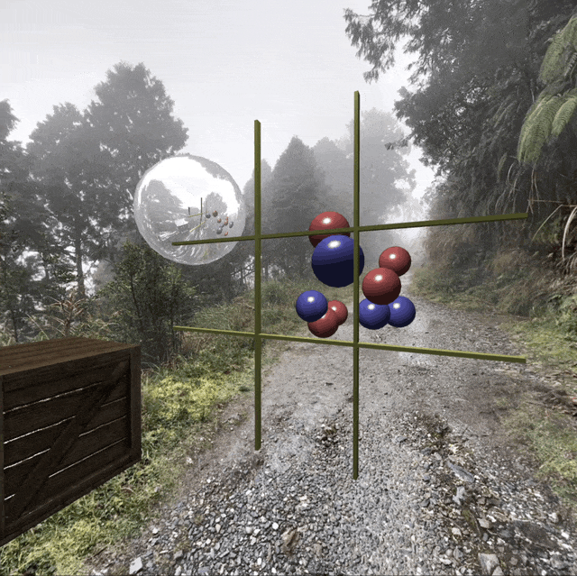

# Taiko 3D

The Final Project for the course of CS Computer Graphics 2024 at the National Taiwan Normal University.

You can play the game [here](https://taiko3d.pages.dev/).

## Introduction

[The headless game engine is written in Rust](https://github.com/JacobLinCool/rhythm-rs) and compiled to WebAssembly. It uses WebGL for 3D rendering and Audio/AudioContext for music and sound effects.

The player is a big white cube, you can rotate and move it with first-person view controls. The third-person view is a fixed camera.

A point light with local illumination has been implemented, it has three colors that respond to the game actions.

The wooden box has a nice texture with bump mapping.

The sphere mirror is implemented with dynamic reflection.

The note spheres are coming to you with the music, you can hit them when they approach the yellow hit zone.

## Copyright Notice

All songs, TJA, and OBJ files are from the internet, the original author holds the copyright.
The environment map is my own creation, I took the photo at 太平山 in a random day.
